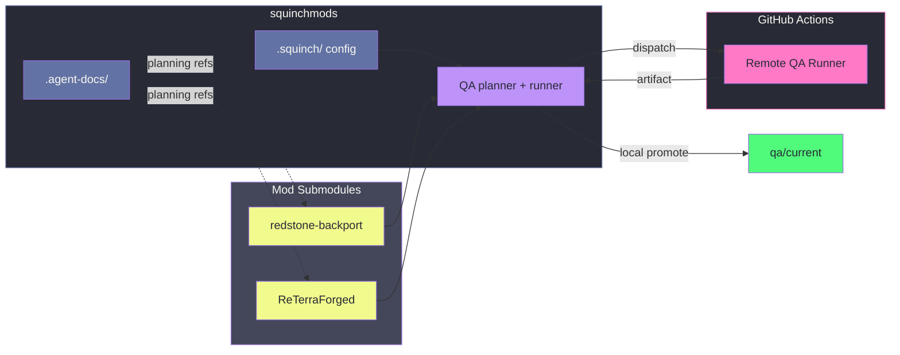

# .agent-docs

Central home for agent-facing planning and reference material across squinchmods. This exists mainly
to keep mod submodules clean, especially forks used for upstream contribution, which should never
need squinchmods-specific planning clutter on a branch that might get PR'd upstream. Anything that
isn't meant to become part of a mod's own repo belongs here instead.

## Root structure

squinchmods is a multi-game workspace: `games/<game>/` holds each game's mods, tooling, and
reference material. Root-level tooling and config (this directory included) stay game-agnostic;
anything that only makes sense for one game belongs under that game's own directory, not at the
root. As more games get added, the root should stay small.

Mods are git submodules under `games/<game>/mods/<mod>/`. `.squinch/` is the other repo-wide
directory with the same rationale as this one: it holds QA config (parent defaults plus per-mod
config) centrally, rather than inside each mod's own repo, so upstream-facing fork submodules never
need squinchmods-specific files on a branch that might get PR'd upstream. See
`games/minecraft/README.md` (below) for how the QA system actually uses it.

`.squinch/`'s config _mechanism_ is game-agnostic (profiles are just named test-id lists), but its
current _content_ is not: the global default profile's test list and the mod-config schema's
required `target` fields (`minecraft`, `loader`, `java`) are Minecraft-specific, since Minecraft is
the only game with real QA needs so far. A second game adopting this system will need its own target
shape, not necessarily this one; don't assume the schema is already generic.



This is the structural relationship only; the QA plan/run/promote pipeline itself is covered in
`games/minecraft/README.md`, not duplicated here.

## Layout

```text
.agent-docs/
  README.md                     this file
  refs/                         cross-cutting reference notes not tied to one game/mod
  games/
    <game>/
      README.md                 architecture/conceptual docs for that game's tooling
      mods/
        <mod>/
          README.md
          plans/                durable investigation/design docs for that mod
          refs/                 durable reference notes (branch maps, decisions) for that mod
  runs/                         optional summarized run reports worth keeping long-term
  tmp/                          disposable scratch, gitignored, safe to delete anytime
  .cache/                       disposable generated cache, gitignored
  private/                      local-only notes, gitignored
```

`games/minecraft/README.md` is the entry point for the Minecraft QA system's architecture.
`games/minecraft/mods/ReTerraForged/` holds that fork's own investigation history (worldgen tuning,
branch tracking, etc.), unrelated to the QA tooling docs.

## Maintenance

- Durable decisions go in `plans/` or `refs/`; temporary exploration goes in `tmp/` or `.cache/` and
  should never need to be committed.
- Don't let a plan doc outlive the work it planned. Once something is built, either fold anything
  still worth knowing into real reference documentation (this repo's `README.md`, a game's
  `README.md`, or the tool's own README) and delete the plan, or just delete it if nothing durable
  survives. A plan describing already-shipped work isn't documentation. It's a changelog nobody
  reads, and it rots the moment reality moves past it.
- Keep reference docs conceptual and current-state-only. If a doc would need to change every time an
  implementation detail shifts, it's too specific for this level. Put that detail in the tool's own
  README/docstrings instead, and keep this layer about the durable ideas: why things are shaped the
  way they are, and where to find more.
