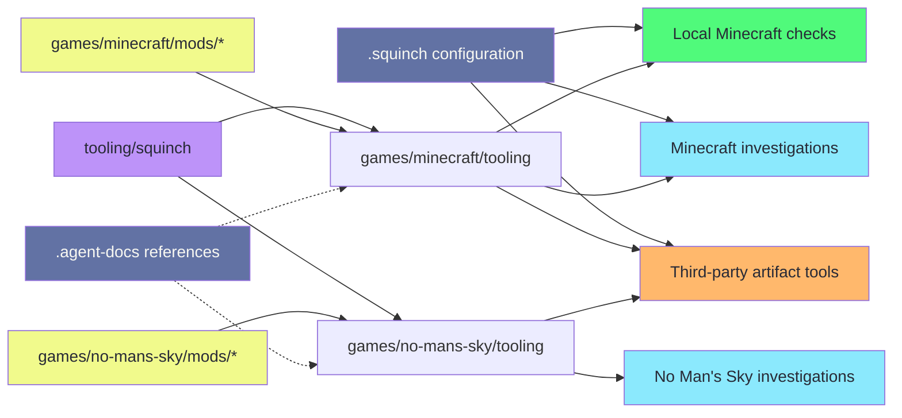

# Agent documentation

This directory contains repository guidance, technical references, and retained investigation
analysis. Game-specific material lives under `games/<game>/`.

## Workspace map

Mods are Git submodules under `games/<game>/mods/<mod>/`. Game tooling, investigations, and
reference material live beside them. The `tooling/squinch` dispatcher provides entry points to tools
implemented under each game's `tooling/` directory.

`.squinch/` contains repository-owned tooling configuration, including Minecraft check profiles and
investigation scenarios, plus third-party artifact catalogs for both games.


```mermaid
flowchart LR
    Dispatcher[tooling/squinch] --> MCTools[games/minecraft/tooling]
    Dispatcher --> NMSTools[games/no-mans-sky/tooling]
    Config[.squinch configuration] --> Checks[Local Minecraft checks]
    Config --> MCInvestigate[Minecraft investigations]
    Config --> Artifacts[Third-party artifact tools]
    MCTools --> Checks
    MCTools --> MCInvestigate
    NMSTools --> NMSInvestigate[No Man's Sky investigations]
    MCTools --> Artifacts
    NMSTools --> Artifacts
    MCMods[games/minecraft/mods/*] --> MCTools
    NMSMods[games/no-mans-sky/mods/*] --> NMSTools
    Docs[.agent-docs references] -.-> MCTools
    Docs -.-> NMSTools

    style Dispatcher fill:#bd93f9,color:#282a36
    style Config fill:#6272a4,color:#f8f8f2
    style Checks fill:#50fa7b,color:#282a36
    style MCInvestigate fill:#8be9fd,color:#282a36
    style NMSInvestigate fill:#8be9fd,color:#282a36
    style Artifacts fill:#ffb86c,color:#282a36
    style MCMods fill:#f1fa8c,color:#282a36
    style NMSMods fill:#f1fa8c,color:#282a36
    style Docs fill:#6272a4,color:#f8f8f2
```

## Layout

```text
.agent-docs/
  README.md                         workspace documentation map
  refs/                             cross-game technical references
  games/
    <game>/
      README.md                     game tooling and reference guide
      mods/<mod>/
        README.md                   mod documentation entry point
        plans/                      active technical plans
        refs/                       durable technical findings
  runs/                             retained investigation analysis
  tmp/                              disposable scratch files
  .cache/                           generated documentation cache
  private/                          local-only notes
```

The Minecraft tool guides are `.agent-docs/games/minecraft/README.md` and
[`games/minecraft/tooling/qa/README.md`](../games/minecraft/tooling/qa/README.md). Minecraft
investigation inputs live in `games/minecraft/investigations/`; generated runs live in the ignored
`games/minecraft/investigation-state/`. Scenario definitions and artifact catalogs are under
`.squinch/games/minecraft/`.

The No Man's Sky reference entry point is `.agent-docs/games/no-mans-sky/README.md`; its executable
tools live under `games/no-mans-sky/tooling/` and are available through `tooling/squinch`.

## Documentation maintenance

- Keep durable technical findings in `refs/` and current plans in `plans/`.
- Update the relevant tool guide when commands or configuration change.
- Keep reference documents focused on current behavior and established findings.
