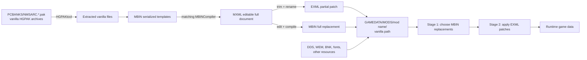

# No Man's Sky Modding Architecture

## Scope and current status

This is the repository's technical entry point for No Man's Sky modding. It describes the PC/Steam
data-mod system introduced in Worlds Part II, how that system behaves on this Bazzite workstation,
and the separate runtime-hook ecosystem. It does not cover AMUMSS Lua authoring: a Lua file is a
build recipe consumed by AMUMSS, not a file the game executes.

The reference was validated on September 15, 2026 against the current public PC release, Cosmos
7.01, and Steam build `25320008`. Hello Games shipped 7.01 on September 10, 2026.[^1] The installed
game, its generated settings, representative deployed mods, current community tool source, and a
real HGPAK extraction were inspected locally.[^2]

The supplied `NMS Modding 6.04.pdf` is about a year old, but “6.04” is not the game version it
documents. Its first page identifies document revision 1.4.2 dated September 7, 2025, and the Nexus
upload calls the file version `6.0.4.0b`; it covers the 5.58-to-6.x loader.[^3] Its central model
remains correct in 7.01. These parts have aged:

- Compatibility cannot now be inferred from the PDF's January/March 2025 update-date cutoffs. Check
  the exact game version, mod format, affected vanilla paths, and author compatibility statement.
- Its uncertainty over whether HGPAK files can be deployed as mods is resolved for ordinary PC
  modding: game assets remain in HGPAK `.pak` archives, but deployable data mods are loose directory
  trees. Do not package a modern PC mod as a `.pak`.
- Its folder-length limit and some hot-reload limitations remain community observations, not a
  documented stable Hello Games contract. Treat them as troubleshooting clues, not API guarantees.

Hello Games does not publish an SDK, a supported mod API, or comprehensive author documentation that
could be found. Its public documentation consists mainly of patch notes acknowledging the loader and
support articles that ask players to disable unsupported mods while diagnosing problems.[^4] The
detailed contract is therefore an evidence-backed community reverse-engineering contract and can
change in any game update.

## The two modding systems

Do not conflate data mods with runtime hooks.

| System                    | What it changes                     | What the game receives                                               | Current status on Bazzite                                                             |
| ------------------------- | ----------------------------------- | -------------------------------------------------------------------- | ------------------------------------------------------------------------------------- |
| Loose data mod            | Serialized game data and assets     | `.EXML`, `.MBIN`, and resources under `GAMEDATA/MODS/<mod>/`         | Current and works through Proton because the Windows game reads ordinary files        |
| Runtime-hook mod          | Live functions and memory           | Injected Python/native code through NMS.py/pyMHF or another injector | One exact-build System Search path is proven through Proton; no general support claim |
| Build recipe              | Generates a data mod                | AMUMSS consumes `.lua`, then emits accepted game files               | Out of scope here; the game never executes the Lua                                    |
| Save editor               | Persistent player/save values       | Rewrites `.hg` save data outside the game                            | A tool, not a loaded mod                                                              |
| Generic graphics injector | Post-processing or API interception | Usually DLL/config/shader files beside the executable                | Separate from the NMS data loader and tool-specific                                   |

The rest of the document uses “mod” to mean a loose data mod unless it explicitly says “runtime-hook
mod.”

## Data flow



Worlds Part II 5.50 changed both ends of this flow. Hello Games replaced the old PC mod workflow
with more precise conflict handling and an explicit mod-settings file.[^5] It also replaced the
source archive format: current `.pak` files begin with the `HGPAK` signature and use a chunked
archive understood by HGPAKtool. The current Windows archives use Zstandard compression; macOS uses
LZ4, and Switch uses Oodle in HGPAKtool's platform model.[^6]

The distinction is important:

- `GAMEDATA/PCBANKS/*.pak` files are the game's compressed **source assets**.
- `GAMEDATA/MODS/<mod>/...` is the game's modern **deployment overlay**.
- `GAMEDATA/PCBANKS/MODS` and `DISABLEMODS.TXT` belong to the retired pre-5.50 PSARC workflow.

Some old wiki pages still instruct authors to use PSARCTool, rebuild a `.pak`, put it in
`PCBANKS/MODS`, and delete `DISABLEMODS.TXT`. Those instructions were last edited before the 5.50
transition and are now wrong.[^7]

## Bazzite and this installation

No Man's Sky is the Windows Steam build running through Proton. Proton changes how the executable
runs; it does not move the game's own content tree into the Wine prefix. On this workstation:

```text
Game root:
  /home/scott/.local/share/Steam/steamapps/common/No Man's Sky

Canonical resolved root:
  /var/home/scott/.local/share/Steam/steamapps/common/No Man's Sky

Data mods:
  <game-root>/GAMEDATA/MODS/<mod-name>/...

Vanilla archives:
  <game-root>/GAMEDATA/PCBANKS/NMSARC.*.pak

Mod settings:
  <game-root>/Binaries/SETTINGS/GCMODSETTINGS.MXML

Game log:
  <game-root>/GAMEDATA/FullLog.txt

Steam manifest:
  /home/scott/.local/share/Steam/steamapps/appmanifest_275850.acf

Proton save root:
  /home/scott/.local/share/Steam/steamapps/compatdata/275850/pfx/drive_c/users/steamuser/
    AppData/Roaming/HelloGames/NMS/<account>/
```

Bazzite exposes home directories through both `/home` and `/var/home`; the first game-root path
resolves to the second. Either spelling reaches the same installation. Do not assume this path on
another machine: use Steam's **Manage → Browse local files**, or read each Steam library's
`steamapps/libraryfolders.vdf` and the app manifest for app ID `275850`.

The local Amethyst installation stages mods below `/home/scott/Games/Amethyst/No Man's Sky/` and
deploys them into the real `GAMEDATA/MODS` tree with symbolic links. That is manager state, not a
second location from which NMS loads mods. The current on-disk deployment contained 44 EXML patches,
129 MBIN replacements, and five DDS resources, and `GCMODSETTINGS.MXML` had enumerated the mod
folders as enabled. Amethyst is a current Linux-native manager and officially supports several
deployment methods, but manual placement remains the simplest ground truth.[^8]

For Flatpak managers, filesystem permission is an additional boundary. The manager must be able to
read its staging directory and write or link into the chosen Steam library. A manager reporting
“deployed” is insufficient evidence; inspect the real `GAMEDATA/MODS` tree and resolve its links.

## What the loader recognizes

Each mod gets one immediate child directory of `GAMEDATA/MODS`. Below that directory, preserve the
vanilla relative path and filename. Do not install a download's wrapper directory if that leaves the
actual mod one extra level deep.

```text
GAMEDATA/MODS/
  Example Mod/
    GLOBALS/
      GCGAMEPLAYGLOBALS.GLOBAL.EXML
    METADATA/
      REALITY/
        TABLES/
          REWARDTABLE.EXML
    MODELS/
      ...
    TEXTURES/
      ... .DDS
    LocTable.MXML
```

The meaningful formats are:

| Format                                               | Role                                                       | Loader behavior                                                                   |
| ---------------------------------------------------- | ---------------------------------------------------------- | --------------------------------------------------------------------------------- |
| `.EXML`                                              | Partial structured patch                                   | Merges only the described paths/properties into current data                      |
| `.MBIN`                                              | Complete serialized object                                 | Replaces the vanilla or earlier replacement file at that path                     |
| `.MXML`                                              | Full textual form emitted/accepted by current MBINCompiler | Not generally loaded as a mod; `LocTable.MXML` is the deliberate exception        |
| `LocTable.MXML`                                      | Per-mod localization table at mod root                     | Adds or overrides localization IDs without replacing vanilla language tables      |
| `.DDS`, `.WEM`, `.BNK`, fonts, and similar resources | Non-MBIN assets                                            | Loaded loose at their vanilla/custom path where the engine supports that resource |
| `.pak`                                               | HGPAK source archive                                       | Not the normal deployable PC mod format after 5.50                                |
| `.lua`, `.txt`                                       | Author notes or build source                               | Ignored by the game loader                                                        |

“EXML” changed meaning in 5.50. Before that release it was chiefly MBINCompiler's editable
intermediate format. Current MBINCompiler deliberately emits **MXML**, matching the game's full
native textual representation. An author creates a modern EXML patch by retaining the required MXML
structure, deleting everything unrelated to the intended change, and saving/renaming the result with
an `.EXML` extension.[^9]

Do not compile a partial EXML patch with MBINCompiler. It is interpreted and merged by the game at
runtime. Conversely, do not take an entire MXML document, rename it to EXML, and call it a patch:
that creates unnecessary overlap and defeats the compatibility benefit.

## EXML merge semantics

An EXML patch is a structural operation, not a textual diff. It must retain the `Data` template and
every parent `Property` needed to reach the target. Untouched sibling data should normally be
removed.

```xml
<?xml version="1.0" encoding="utf-8"?>
<Data template="<template from the current vanilla MXML>">
  <Property name="<parent>">
    <Property name="<target-field>" value="<new-value>" />
  </Property>
</Data>
```

Scalar or uniquely named fixed entries can be targeted by their `name`. Expandable arrays need the
metadata introduced and refined in 5.50/5.58:[^10]

- `_id="..."` targets an existing list entry by its stable ID field.
- `_index="..."` targets an existing entry by its generated position when no unique ID exists. Use
  `_id` and `_index` together for duplicate IDs when the exported current data provides both.
- A list entry that does not match an existing `_id`/`_index` is appended; those attributes select
  existing entries and do not assign arbitrary persistent IDs to new entries.
- `_remove="true"` removes the targeted entry and its children. Hello Games fixed removal processing
  in 5.73 to erase indexed elements in reverse order so earlier removals do not shift later
  targets.[^11]
- `_overwrite="true"` replaces the entire targeted entry/table. Every child that must survive must
  be supplied, because omitted values fall back to defaults.

Treat generated indices as properties of the exact current merged input, not timeless identifiers.
Game 5.58 improved array indexing and exposed index IDs more clearly in exported modded metadata,
specifically to support merging.[^10] Prefer `_id` when it is unique. Re-extract and re-check
indices after game updates or after changing mods that add/remove earlier entries.

Adding a new structured entry is also not equivalent to defining a new file. Missing fields in a new
or fully overwritten object can receive type defaults rather than useful vanilla values. Start from
the current full object, retain all required fields, and then minimize only where patch semantics
permit it.

## Full MBIN replacements and loose resources

Use a full MBIN replacement when the loader cannot represent the change as a safe partial patch. The
current community hard-exception list is:[^12]

- `.SCENE` (`cTkSceneNodeData`)
- `.MATERIAL` (`cTkMaterialData`)
- `.PARTICLE` (`cTkParticleData`)
- `.ANIM` (`cTkAnimMetadata`)
- `.DESCRIPTOR` (`cTkModelDescriptorList`)
- `.GEOMETRY.DATA` (`cTkGeometryData`)
- `cGcNGuiLayerData` files under `UI`

New custom serialized files also generally need an MBIN representation; this includes new custom
`.ENTITY` and `.TEXTURE` objects even where an existing object of that family may accept EXML
changes. Some linked `.ENTITY` components and unusual enum encodings have additional patch
limitations. Verify those against the current exported object rather than generalizing from another
template.

MBIN replacements are brittle because their binary layout is versioned with the game. Current
MBINCompiler maps those layouts to generated C# template classes and warns that every NMS update may
change some structures.[^9] A replacement should therefore be rebuilt from the new vanilla MBIN with
a matching compiler after an affected update. A successful compile alone is not enough: round-trip
the unmodified current vanilla input first, then test the actual replacement in game.

For Globals there is an unintuitive path rule retained in current deployments:

- EXML patches belong below the mod's `GLOBALS/` directory.
- Full replacement Global MBINs may need to sit at the root of the mod directory, matching the
  archive's root-relative location.

Ordinary resources such as DDS textures remain loose files at their expected paths. Their content
formats have their own constraints; the EXML merge engine does not merge image, audio, geometry, or
shader bytes.

### UI, menu, and Catalogue changes

“Adding a page” is not one universal operation. Separate the data that makes an entry exist from the
UI object that lays it out:

| Desired change                                                 | Typical seam                                                                                                                  | Compatibility character                                                      |
| -------------------------------------------------------------- | ----------------------------------------------------------------------------------------------------------------------------- | ---------------------------------------------------------------------------- |
| Add a Catalogue category backed by existing items              | Append `GcWikiCategory` objects through a narrow EXML patch                                                                   | Usually composable when identifiers and the current template still resolve   |
| Add a Guide topic that launches an existing/custom mission     | Append a `GcWikiTopic` with `Mission` and `MissionButtonText`, plus the corresponding mission data                            | Reuses the vanilla Guide controller; no UI layout replacement                |
| Add or repurpose a quick-menu action                           | Patch/append the relevant data table such as `EMOTEMENU`, then connect existing action, reward, mission, or animation systems | Data-driven, but every shared target and referenced behavior must be checked |
| Change an existing tab's label or icon                         | Narrow EXML write to its current category selector plus existing/custom localization and icon resources                       | Narrow when the selector is stable                                           |
| Rearrange controls, grids, focus behavior, or element geometry | Full `cGcNGuiLayerData` MBIN below `UI`                                                                                       | Whole-file replacement; schema- and update-sensitive                         |
| Add new visible strings or art                                 | Root `LocTable.MXML` and loose resources at their referenced paths                                                            | Names must be unique and resource formats valid                              |

The [Ship Parts Catalogue inspection](refs/third-party/ship-parts-catalogue.md) demonstrates the
first pattern: five apparent “pages” are category records appended to `CATALOGUERECIPES`, with no
new UI layout binary. [Lush Finder](refs/third-party/lush-finder.md) demonstrates a quick-menu entry
that launches a chain of existing animation, reward, mission, scan, and navigation systems.
[Expedition Catalogue Improved](refs/third-party/expedition-catalogue-improved.md) demonstrates the
boundary: changing the Journey tab icon is a small EXML operation, while fitting four expedition
patches per row replaces two complete UI MBINs and becomes invalid when their nested GUI schema
changes.

The live [system-search investigation](working/system-search-investigation.md) applies those seams
to a planet finder and owns the current architecture decision. Current vanilla Guide topics already
launch Wiki missions containing scan events, making that a substantially smaller launcher than a
quick-menu/player-animation chain.

Prefer the data seam when it fully expresses the feature. When it does not, treat a UI MBIN as a
version-specific rebuild product: start from the exact current vanilla object, preserve unrelated
current fields and controls, and revalidate navigation, focus, input mode, resolution, UI scale, and
localization after every affected update.

The bar above those pages is a different ownership boundary. Current 7.01 extraction identifies
`UI/COMPONENTS/PAGESELECTBAR.MBIN` as a generic seven-slot `cGcNGuiLayerData` layout, while current
executable strings and generated page-hint types identify concrete Inventory, Discovery, Journey,
Wiki/Catalogue, Mission Log, Expedition, and Options routes. The layout can draw another control but
does not define a new frontend route or page controller. A genuinely new peer tab therefore is not
realistic through ordinary EXML/MBIN data modding: it requires a version-qualified executable hook
with a proven route, controller, focus/input, and lifecycle contract. The current System Search
proves a narrower Proton injection and owned-window seam; it does not implement or justify taking
ownership of a native peer tab.[^2][^9][^15][^16]

## Load order and conflicts

Loading has two global stages:

1. Full MBIN replacements are resolved in mod-priority order. If several mods replace the same path,
   the last replacement wins.
2. EXML patches are then applied, in mod-priority order, to the selected replacement if one exists,
   otherwise to vanilla data.

Consequences:

- An EXML patch can modify a winning replacement supplied by a different mod.
- Two patches that touch disjoint fields usually compose.
- Two patches that set the same scalar or replace/remove the same entry still conflict; the later
  patch wins for the overlapping operation.
- Two MBIN mods that replace the same file do not merge merely because their changes are logically
  unrelated.
- A minimal EXML patch narrows the conflict surface and normally survives updates better, but it is
  not automatically compatible with every mod or future schema.

The generated settings file records `ModPriority` per mod. The priority direction is
counterintuitive: in the supplied guide's observed behavior, the **lowest numeric priority loads
last and wins**. Default priorities are derived from mod-folder names; the local 7.01 settings
corroborate that folder enumeration still populates ascending numeric priorities.[^2][^3] Do not
encode semantic dependencies in punctuation-heavy folder names when a manager or explicit settings
order can express them.

The current serialized `GcModSettingsInfo` structure also contains `Name`, `Author`, `ID`,
`AuthorID`, `LastUpdated`, `ModPriority`, `Enabled`, `EnabledVR`, and `Dependencies` fields.[^13]
Their presence in the reverse-engineered structure does not by itself establish a public metadata or
dependency-resolution contract. For ordinary loose folders, only enabled state and observed priority
should be relied upon without further runtime evidence.

## Enabling, disabling, and recovery

`Binaries/SETTINGS/GCMODSETTINGS.MXML` is game-owned state. Its top-level `DisableAllMods` flag can
disable the whole set; each enumerated mod also has `Enabled` and `EnabledVR`. Deleting this file is
a reasonable reset operation because the game rebuilds it, but it also discards custom enable/order
choices. Back it up if those choices matter.

Do not recreate or delete the old `GAMEDATA/PCBANKS/DISABLEMODS.TXT`. Since Beacon, modern startup
and crash dialogs can offer to disable detected mods, and disabling is no longer their automatic
default behavior.[^14] Current local logs also show the game probing the profile cache for a
`DISABLEMODS` marker, which is distinct from the retired PCBANKS text-file mechanism.[^2]

For a crash or bad load:

1. Back up the Proton save directory.
2. Set `DisableAllMods` or temporarily move the immediate children of `GAMEDATA/MODS` out of the
   loader tree. If a manager owns the deployment, purge/undeploy through it or preserve its links
   before changing them manually.
3. Delete/regenerate `GCMODSETTINGS.MXML` only when stale enable/priority state is suspected.
4. Reproduce with zero mods, then restore one coherent group at a time.
5. Inspect `GAMEDATA/FullLog.txt`, the main-menu build number, Steam `buildid`, mod versions, and
   the exact deployed tree. A startup warning proves detection, not correct application.

Hello Games explicitly recommends removing mods before reporting performance or stability problems
because mods are unsupported and can be especially disruptive after an update.[^4] Preserve a
known-good save backup before testing changes that alter missions, inventories, procedural content,
or persistent unlocks.

## Authoring on Bazzite

Third-party Nexus artifacts used for investigation are acquired through the catalog-backed
[`third-party no-mans-sky` tooling](../../../games/no-mans-sky/tooling/third-party/README.md). The
committed catalog owns identity and hashes, while downloaded archives and unpacked inspection trees
stay local and ignored so restrictive mod licenses are not violated.

Externally maintained mods are inspection inputs, not workspace mods. Their durable findings belong
under this game's `refs/third-party/` documentation tree, while their local extracted contents
mirror Minecraft below `games/no-mans-sky/reference/sources/<claimed-version>/mods/<mod>/`. The
current inspection corpus includes:

- [Lush Finder Full Mission](refs/third-party/lush-finder.md), including a concrete 6.45-to-7.01
  scene-schema failure;
- [Ship Parts Catalogue](refs/third-party/ship-parts-catalogue.md), a narrow append-style Catalogue
  EXML whose 418 references were checked against current data; and
- [Expedition Catalogue Improved](refs/third-party/expedition-catalogue-improved.md), whose pinned
  6.40 file is now a historical failure-boundary control because a 7.00 main file is available; and
- [BG Dark UI and Fonts](refs/third-party/bg-dark-ui-fonts.md), a current main-file path-overlap
  reference whose 6.45.1 full button layout is stale on 7.01; and
- [Weather Indicator Short](refs/third-party/weather-indicator.md), a localization-only weather-key
  taxonomy whose 305 keys still exist in 7.01, but which contains no runtime classifier.

### 1. Acquire the current vanilla input

Use HGPAKtool, not PSARCTool. Current HGPAKtool provides Linux binaries and a Python package and
only supports the post-5.50 HGPAK format.[^6] Although both its `windows` and `linux` modes
currently use Zstandard, specify `--platform windows` because the installed depot is the Windows
game run through Proton.

```bash
NMS_ROOT="/home/scott/.local/share/Steam/steamapps/common/No Man's Sky"

hgpaktool -L -p --platform windows \
  "$NMS_ROOT/GAMEDATA/PCBANKS/NMSARC.globals.pak"

hgpaktool -U --platform windows --output ./extracted \
  --filter 'gcspaceshipglobals.global.mbin' \
  "$NMS_ROOT/GAMEDATA/PCBANKS/NMSARC.globals.pak"
```

The first command was reproduced against the local 7.01 `NMSARC.globals.pak`; the current tool read
the archive and listed its Globals without modifying the installation.[^2] HGPAKtool's PC repacking
support is intentionally unnecessary/unsupported for ordinary mod deployment. Use it to extract and
inspect, not to produce PC mod archives.

### 2. Convert with the matching MBINCompiler

Use the compiler release for the installed public or experimental game branch, not simply the
newest-looking download. Current upstream publishes Linux builds and requires the corresponding .NET
runtime.[^9]

```bash
MBINCompiler ./extracted/gcspaceshipglobals.global.mbin
```

On an immutable Bazzite host, keep the toolchain user-owned or inside a Distrobox/Toolbox container;
do not layer development runtimes into the base image merely for convenience. The container can read
a working copy under the home directory. The game itself does not need MBINCompiler installed.

Before editing, prove this compiler can decompile and recompile the untouched current MBIN. A tool
release can lag a same-day NMS patch, and template coverage can be partial.

### 3. Choose the narrowest correct output

- For a supported field/list change, retain the required MXML ancestry, strip unrelated data, and
  save it as `.EXML` under the vanilla relative path.
- For a hard exception or genuine whole-object replacement, edit the complete MXML and compile it
  back to `.MBIN`.
- For an external resource, preserve the expected vanilla/custom path and valid resource format.
- Put `LocTable.MXML` at the mod root for custom localization IDs.

Develop outside the live installation, then deploy an immutable/copy/symlinked artifact. This keeps
extracted vanilla files, authoring source, and accepted runtime files distinct.

### 4. Validate the merged result

`GLOBALS/GCDEBUGOPTIONS.GLOBAL.MBIN` exposes two useful community-documented switches:[^12]

- `SaveOutModdedMetadata` exports the merged MXML the game actually used beneath
  `GAMEDATA/MODS/EXPORTED`, but only after the relevant object is loaded.
- `HotReloadModGlobals` can reload some EXML values while the game is running. A value already held
  by a live subsystem may not update; absence of a visible change does not prove the patch was
  rejected.

Exported merged metadata is the strongest readily available structural oracle: it shows whether a
path targeted the intended `_id`/`_index`, whether another mod won, and what defaults appeared after
an addition/overwrite. It still does not replace behavioral testing in the relevant gameplay state.

Recommended validation order:

1. XML parse/lint the authored patch, while remembering the game parser may support special patch
   attributes beyond a generic schema.
2. Round-trip current vanilla MBINs with the matching compiler when producing replacements.
3. Run with only the mod under test and confirm it is enumerated/enabled.
4. Export merged metadata and compare only the intended paths.
5. Exercise the relevant game state with a disposable or backed-up save.
6. Add conflicting/cooperating mods and test both priority orders.
7. Repeat after every affected NMS update; record the Steam build ID and compiler commit/release.

The repository automates the static and deterministic portions through
[`tooling/squinch nms-investigate`](../../../games/no-mans-sky/tooling/investigate/README.md). Use
its versioned run envelopes and committed scenarios rather than ad hoc extraction directories.

## Runtime-hook mods

Data files can alter objects and behaviors the engine already knows how to deserialize. They cannot
generally introduce arbitrary executable logic. Runtime-hook frameworks cross that boundary by
finding functions/objects in `NMS.exe`, injecting code, and detouring calls.

NMS.py is the current actively maintained NMS-specific option found in source. It builds on pyMHF,
maps reverse-engineered types and Globals, locates functions with byte signatures, and supports
before/after hooks, callbacks, a generated UI, a Python REPL, and mod reloads.[^15] Its source was
updated for the Cosmos-era executable on September 8, 2026.[^2]

This is a separate loader and risk model:

- Hooks are coupled to executable layouts/signatures and can break on even small game updates.
- A bad hook can corrupt live memory or persistent save state rather than merely produce a bad data
  merge.
- pyMHF uses `pymem`, Win32 APIs, Windows process handles, MinHook, and DLL-based Python injection;
  both packages declare Win32 as their environment.[^16]
- Upstream instructions assume Windows Python and a Windows process. Running the Linux Python
  package directly on Bazzite cannot inject into NMS under Proton.

The repository now has a reproducible, current-build-pinned NMS.py/pyMHF attach path on this Bazzite
host. A hash-locked Windows runtime executes inside the live Proton mount namespace. Because MinHook
cannot reserve its near relay on the observed layout, the System Search bridge owns one
instruction-relocating absolute hook, validates exact executable prefixes, restores that hook before
injection shutdown, and verifies target-process survival. This proves the documented System Search
path on the current executable; it is not a claim that arbitrary pyMHF mods, another NMS build, VR,
or every overlay configuration work on Proton. See the
[current search record](working/system-search-investigation.md) and
[runtime instructions](../../../games/no-mans-sky/tooling/runtime/README.md).

The Reloaded-II `NoMansSky.Api` repository is useful historical evidence for C# memory-hook modding,
but its last source change was June 2023 and its instructions involve an old executable-patching
workflow.[^17] It is not a current 7.01 recommendation. The still older NMSE/script-extender path is
also obsolete.

## Compatibility model

“Works with NMS” is not one capability. Record at least:

| Compatibility axis                | Why it matters                                                                        |
| --------------------------------- | ------------------------------------------------------------------------------------- |
| Game release and Steam build ID   | Asset layouts and executable signatures change independently                          |
| Public vs experimental branch     | MBINCompiler publishes/labels support separately when they diverge                    |
| Mod representation                | EXML patch, MBIN replacement, resource overlay, and runtime hook fail differently     |
| Vanilla target path/template      | Only changed schemas/assets need rebuilding, but moved/removed targets silently fail  |
| Other installed mods and priority | The actual base for an EXML patch may be another mod's MBIN replacement               |
| VR state                          | `EnabledVR` is independent in generated settings                                      |
| Host/runtime                      | Loose data works through Proton; Win32 injectors are a separate support claim         |
| Persistence boundary              | Some changes affect only presentation; others alter saves or generated worlds/content |

Repository tooling models NMS as extraction and overlay validation rather than as a Gradle/build
target analogue to Minecraft. It records the Steam build ID, archive/asset hashes, HGPAKtool and
MBINCompiler identities, mod representation, and affected paths; proves archive readability, path
validity, XML structure, MBIN round trips, overlap/conflict surfaces, and intended merged metadata;
and retains those outputs below an ignored run boundary. Visual/gameplay behavior still requires a
controlled Proton launch and backed-up disposable save fixture.

## Durable rules

- Start every investigation from the live Steam app manifest and official release log.
- Treat the 5.50 loose-file loader as current, but never as immutable.
- Never use `PCBANKS/MODS`, PSARCTool, or `DISABLEMODS.TXT` for a modern PC build.
- Extract current vanilla HGPAKs with current HGPAKtool; do not copy old extracted trees forward.
- Match MBINCompiler to the exact game branch and prove an untouched round trip.
- Prefer minimal EXML patches; use MBIN only where the data contract requires a full replacement.
- Preserve vanilla paths and required MXML ancestry.
- Use `_id` before `_index` when unique, and validate generated indices against merged current data.
- Treat load order as a conflict resolver, not a substitute for compatibility testing.
- Keep authoring sources and ignored `.lua`/notes out of the runtime contract.
- Back up saves and reproduce failures with all mods disabled before blaming the game.
- Treat runtime injection as unsupported on Bazzite except for an exact-build path with its own
  attachment, hook, lifecycle, and teardown evidence.

## Sources

[^1]:
    Hello Games. “[Cosmos 7.01](https://www.nomanssky.com/2026/09/cosmos-7-01/).” September
    10, 2026.

[^2]:
    Local evidence snapshot, September 15, 2026: Steam app manifest `275850` build `25320008`;
    `NMS.exe` and `GAMEDATA` installation; generated `GCMODSETTINGS.MXML` and `FullLog.txt`;
    deployed mod tree; HGPAKtool `2ea9b0351f93b72e4fa3d199bf4ac54149f748f8` successfully listed the
    installed `NMSARC.globals.pak`; source checkouts recorded at their cited commits. Private
    workstation evidence; no public URL.

[^3]:
    NMS Modding Discord. “NMS Modding after 5.58 (to 6.x),” revision 1.4.2, September 7, 2025.
    User-supplied `/home/scott/Downloads/NMS Modding 6.04.pdf`; Nexus listing:
    “[NMS Modding Information](https://www.nexusmods.com/nomanssky/mods/3749),” upload version
    6.0.4.0b.

[^4]:
    Hello Games. “[Patch 1.12](https://www.nomanssky.com/2016/12/patch-1-12/),” December 7, 2016;
    Hello Games Support.
    “[I am experiencing severe graphics or performance issues on PC](https://hellogames.zendesk.com/hc/en-us/articles/115004591645-I-am-experiencing-severe-graphics-or-performance-issues-on-PC).”
    The former calls installed mods unsupported; the latter recommends disabling them during
    diagnosis.

[^5]:
    Hello Games. “[Worlds Part II Update](https://www.nomanssky.com/worlds-part-ii-update/),” update
    5.50, January 2025, “Smoother Modding Experience” and filesystem notes.

[^6]:
    monkeyman192 et al.
    “[HGPAKtool](https://github.com/monkeyman192/HGPAKtool/tree/2ea9b0351f93b72e4fa3d199bf4ac54149f748f8),”
    commit `2ea9b03`, February 16, 2026. See the README and `hgpaktool/constants.py`, `api.py`, and
    `compressors.py`.

[^7]:
    Step Modifications.
    “[The Modding Basics](https://stepmodifications.org/wiki/NoMansSky:Tutorials/Getting_Started),”
    last edited October 20, 2024. Retained here only as explicit legacy/failure-boundary evidence.

[^8]:
    ChrisDKN et al.
    “[Amethyst Mod Manager](https://github.com/ChrisDKN/Amethyst-Mod-Manager/tree/6d5cf3571f23f846530d237e3207828baf79eca8),”
    version 2.4.3 source at commit `6d5cf35`, September 9, 2026.

[^9]:
    monkeyman192 et al.
    “[MBINCompiler](https://github.com/monkeyman192/MBINCompiler/tree/abeaf218ad6e0792be7bc1e64b0128c98a53ac3d),”
    tag `v7.01.0-pre1`, commit `abeaf21`, September 9, 2026. See its README, converter, MXML
    serializer, generated NMS templates, and version guidance.

[^10]:
    Hello Games. “[Worlds Part II 5.58](https://www.nomanssky.com/2025/03/worlds-part-ii-5-58/),”
    March 4, 2025; NMS Modding Wiki.
    “[Principles of EXML Modification](https://nmsmodding.fandom.com/wiki/Principles_of_EXML_Modification),”
    retrieved September 2026.

[^11]: Hello Games. “[Beacon 5.73](https://www.nomanssky.com/2025/07/beacon-5-73/),” July 1, 2025.

[^12]:
    NMS Modding Wiki.
    “[Principles of EXML Modification](https://nmsmodding.fandom.com/wiki/Principles_of_EXML_Modification),”
    sections “Hard and Soft Exceptions,” “HotReloadModGlobals,” and “SaveOutModdedMetadata,”
    retrieved September 2026.

[^13]:
    MBINCompiler source.
    “[GcModSettingsInfo.cs](https://github.com/monkeyman192/MBINCompiler/blob/abeaf218ad6e0792be7bc1e64b0128c98a53ac3d/libMBIN/Source/NMS/GameComponents/GcModSettingsInfo.cs)”
    and
    “[GcModSettings.cs](https://github.com/monkeyman192/MBINCompiler/blob/abeaf218ad6e0792be7bc1e64b0128c98a53ac3d/libMBIN/Source/NMS/GameComponents/GcModSettings.cs),”
    tag `v7.01.0-pre1`.

[^14]:
    Hello Games. “[Beacon Update](https://www.nomanssky.com/beacon-update/),” update 5.70, engine
    and optimisation notes on startup-error mod handling.

[^15]:
    monkeyman192 et al.
    “[NMS.py](https://github.com/monkeyman192/NMS.py/tree/626c594c8891b7d889d9ae3fffc2505793e5b3be),”
    commit `626c594`, September 8, 2026.

[^16]:
    monkeyman192 et al.
    “[pyMHF](https://github.com/monkeyman192/pyMHF/tree/2ca33d677f7cdeda904d4e714aee721fd03ff8db),”
    commit `2ca33d6`, August 29, 2026. See `pyproject.toml`, `pymhf/main.py`, `pymhf/injected.py`,
    and hook documentation.

[^17]:
    gurrenm3.
    “[NoMansSky.Api](https://github.com/gurrenm3/NoMansSky.Api/tree/1974810b828802377129a03bb96fa2d6f10ded8a),”
    commit `1974810`, June 3, 2023.
